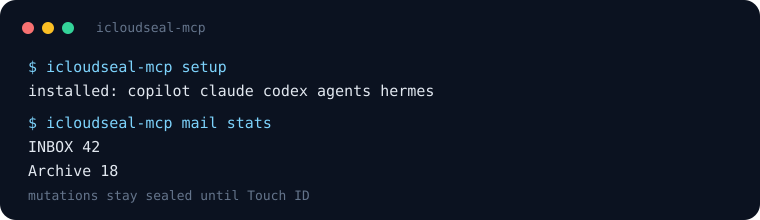
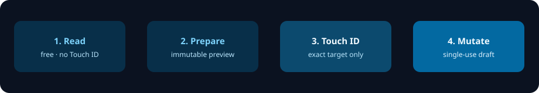

<p align="center">
  
</p>

<h1 align="center">icloudseal</h1>

<p align="center">
  <strong>Sealed iCloud MCP.</strong> Local CLI + stdio for AI agents.<br>
  Reads are free. Every send, create, delete, or open waits for Touch ID.
</p>

<p align="center">
  
  
  
  
  
</p>

<p align="center">
  <a href="#quick-start">Quick start</a> ·
  <a href="#how-it-works">How it works</a> ·
  <a href="#mcp-setup">MCP setup</a> ·
  <a href="#domains">Domains</a> ·
  <a href="#safety-model">Security</a>
</p>

<p align="center">
  
</p>

An unofficial local iCloud layer for the same Mac user who unlocked the session. The agent can read Mail, Contacts, Calendar, Messages, Notes, Drive, Photos, Safari, Music, Weather, Maps, Shortcuts, and Health status. It cannot mutate a single object until a native macOS dialog shows the **exact immutable preview** and you approve it with Touch ID or your login password.

Part of the seal family with [`whatseal`](https://github.com/edosulai/whatseal-mcp) (WhatsApp) and `instaseal-mcp` (Instagram). Started as `icloud-mail-agent` → `icloud-agent` → **`icloudseal-mcp`**.

This is not CloudKit, WeatherKit, or the iCloud web API. Apple can change IMAP, CardDAV, CalDAV, or Automation rules at any time.

---

## Quick start

```bash
pipx install icloudseal-mcp
# or: uv tool install icloudseal-mcp
icloudseal-mcp setup
icloudseal-mcp mail setup --email you@icloud.com
icloudseal-mcp mail stats
```

`setup` copies `/icloudseal` to Copilot, Claude, Codex, `.agents`, and Hermes. Whole-directory home symlinks (dotfiles checkouts) are skipped unless `--force`. It does **not** store credentials.

iCloud blocks regular passwords for IMAP/CardDAV. Generate an app-specific password at [appleid.apple.com](https://appleid.apple.com) → Sign-In and Security → App-Specific Passwords (`xxxx-xxxx-xxxx-xxxx`).

From a git checkout:

```bash
python3.13 -m venv .venv
source .venv/bin/activate
pip install -e ".[dev]"
icloudseal-mcp setup
```

Hermes MCP (installed package):

```bash
printf 'Y\n' | hermes mcp add icloudseal --command icloudseal-mcp-server
```

From a checkout, point Hermes at `mcp-wrapper.sh` instead. Restart Hermes after adding. Verify with both `hermes mcp list` and `hermes config get mcp_servers`.

---

## How it works

<p align="center">
  
</p>

1. **Reads are free.** No Touch ID for list/search/peek. Data stays on this Mac except what enters the chat.
2. **Prepare freezes the exact target.** `icloud_prepare_*` stores a single-use, TTL-bound draft with immutable identities — not a live search query.
3. **Touch ID seals it.** `icloud_request_local_approval` shows that frozen preview in a native dialog. Timeout or uncertainty → `icloud_action_outcome`. Never re-prepare a duplicate mutate.
4. **CLI stays dry-run** unless `--apply`. MCP never claims success unless approval / outcome reports it.

One Keychain item (service `icloudseal-mcp`) authenticates IMAP, SMTP, CardDAV, and CalDAV. Plans, exports, backups, and the compiled helper live under owner-only App Support.

---

## MCP setup

Catalog key: `icloudseal`. Default `install-skill` / `setup` hosts: **copilot, claude, codex, agents, hermes**.

VS Code / Copilot `mcp.json` (git checkout):

```json
{
  "servers": {
    "icloudseal": {
      "type": "stdio",
      "command": "/absolute/path/to/icloudseal-mcp/mcp-wrapper.sh"
    }
  }
}
```

Installed package:

```json
{
  "servers": {
    "icloudseal": {
      "type": "stdio",
      "command": "icloudseal-mcp-server"
    }
  }
}
```

The checkout wrapper self-bootstraps `.venv` + editable install if needed, installs the bundled skill on the default hosts (stderr only; stdout stays MCP stdio), then runs `python -m icloudseal_mcp.mcp.server`. Packaged skill: [`skills/icloudseal/SKILL.md`](skills/icloudseal/SKILL.md).

On Hermes Agent, tools show up as `mcp_icloudseal_icloud_*` or deferred `mcp__icloudseal__icloud_*`. After a successful add, enable them in the current session (`setup_mcp`) or restart Hermes.

### Agent workflow

1. First call: `icloud_doctor` or `icloud_status`
2. Reads: no Touch ID (`icloud_mail_*`, `icloud_contacts_*`, `icloud_messages_*`, …). Local export/plan tools write only to managed App Support directories.
3. Mutations: `icloud_prepare_*` → show exact preview → user OK → `icloud_request_local_approval`
4. After timeout: `icloud_action_outcome` (never blind re-prepare)

### MCP tool groups

| Group | Tools |
|---|---|
| Onboarding | `icloud_doctor`, `icloud_status`, `icloud_security_audit`, `icloud_list_domains` |
| Mail | stats/sync/list/senders/peek/triage/jobs/attachments + prepare apply/cleanup/send/forward/flags/move/trash/create-folder |
| Contacts | list/search/export + prepare create/update/delete |
| Calendar | list/events/reminders/timezones + prepare event add/update/rm and reminder mutations (RRULE/VALARM/PARTSTAT/PRIORITY) |
| Messages | chats/list/search/export + prepare send (optional attach) |
| Notes | list/search/read/accounts/folders + prepare create/update/delete |
| Drive | ls/tree/find/read + prepare mkdir/put/rm/rename/move/copy |
| Photos | stats/albums/list + prepare export/favorite/album-add/create/remove/delete |
| Safari | tabs/current/page-text/extract/bookmarks/history + prepare open-url/search/close-tab/bookmark-add/rm/reading-list-add/rm |
| Music | now-playing/search/playlists + prepare playpause/next/previous/volume/shuffle/repeat/play/playlist-play |
| Weather | forecast (Open-Meteo current+daily; hourly/minutely opt-in) |
| Maps | search URL + prepare open (optional zoom/type) |
| Health | status only (fail-closed) |
| Ops | prepare cleanup-agent (write plist only) |
| Shortcuts | list + prepare run (exact name, optional frozen text input) |
| Gate | `icloud_request_local_approval`, `icloud_action_outcome` |

`icloudseal-mcp setup` / `install-skill` copies `/icloudseal`. `uninstall-skill` removes only that skill copy. `mail-agent <action>` remains a legacy alias for `icloudseal-mcp mail <action>`.

---

## Architecture

```
            ┌──────────────────────────────┐
            │  AI agent (chat session)     │
            │  reads → prepare → approve   │
            └───────┬──────────────┬───────┘
                    │ MCP stdio    │ shell CLI
                    ▼              ▼
        ┌──────────────────────────────────────────┐
        │  icloudseal_mcp/                         │
        │   mcp/       server + approval + tools   │
        │   mail/ contacts/ calendar/ messages/    │
        │   notes/ drive/ photos/ safari/ music/   │
        │   weather/ maps/ health/ ops/ shortcuts  │
        └──────────────────────────────────────────┘
                             │
                             ▼
                             IMAP/SMTP/DAV · local DB · AppleScript · Open-Meteo
```

**One credential for everything.** The same iCloud app-specific password in the
Keychain (service `icloudseal-mcp`) authenticates IMAP, SMTP, **and** CardDAV/CalDAV.
**No external LLM API** — data stays on this Mac except what enters the chat.

---

## Domains

Fourteen domains live (CLI + MCP):

- **Mail (IMAP + SMTP)** — sync/list/triage plus gated cleanup, send (reply/attach), forward, flags, move, trash, and create-folder.
- **Contacts (CardDAV)** — list/search/export plus gated create/update/delete.
- **Calendar + Reminders (CalDAV)** — list/timezones plus gated add/update/rm/done with ATTENDEE PARTSTAT, reminder PRIORITY, TZID, and validated RRULE/VALARM.
- **Messages / SMS** — read `chat.db` plus gated AppleScript send (optional file attach).
- **Notes (AppleScript)** — list/search/read/accounts/folders plus gated create (account picker)/update/delete.
- **iCloud Drive (filesystem)** — ls/tree/find/read plus gated mkdir/put/rm/rename/move/copy (rm → Trash).
- **Photos** — stats/albums/list plus gated export, favorite, album-add/create/remove/delete. Import is not implemented.
- **Safari (AppleScript + FDA store)** — tabs/current/page-text/extract plus bookmarks/history reads. Gated http(s) open, search, close-tab, bookmarks-bar add/rm, and Reading List add/rm.
- **Music (AppleScript)** — now-playing plus library/playlist search (names only). Gated playpause/next/previous, volume, shuffle, repeat, play-by-name, playlist-play.
- **Weather (Open-Meteo)** — current plus daily forecast; hourly and 15-minute rows are opt-in.
- **Maps (maps.apple.com)** — local search/directions URL plus gated open.
- **Health** — status only, fail-closed. No HealthKit scrape.
- **Ops** — write a mail-cleanup LaunchAgent plist. Does not `launchctl load`.
- **Shortcuts** — list plus gated run by exact name.

---

## Setup (one-time)

### 1. App-specific password
iCloud blocks regular passwords for IMAP/CardDAV. Generate one at
<https://appleid.apple.com> → **Sign-In and Security** → **App-Specific
Passwords** (format `xxxx-xxxx-xxxx-xxxx`).

### 2. Install
```bash
cd /path/to/icloudseal-mcp
python3.13 -m venv .venv
source .venv/bin/activate
pip install -e .
```

### 3. Store credentials
```bash
icloudseal-mcp mail setup --email you@icloud.com   # or: mail-agent setup --email ...
```

### 4. Verify
```bash
icloudseal-mcp mail stats          # lists mail folders + counts (IMAP)
icloudseal-mcp contacts list --limit 5   # lists contacts (CardDAV)
```

Contact-name cleanup is optional. Copy
[`scripts/contact_name_rules.example.json`](./scripts/contact_name_rules.example.json)
to `scripts/contact_name_rules.json` and add local skip names / tags there.
The live file is gitignored and must not be committed.

## Mail commands (`icloudseal-mcp mail …` / `mail-agent …`)

| Command | Action |
|---|---|
| `setup --email <addr>` | Store credentials in Keychain (one-time) |
| `stats` | Folder list + message counts |
| `sync [--folder INBOX] [--since 7d]` | Pull metadata into local SQLite cache |
| `list [--folder INBOX] [--limit 50]` | List cached messages |
| `peek <uid>` | Show body of one message |
| `senders [--top 30]` | Top senders by count |
| `triage … --move-to <f> / --delete --plan-file p.json` | Build a dry-run plan |
| `apply p.json [--apply]` | Backup `.eml`, then move/delete via IMAP |
| `cleanup strict [--apply]` | Full-sync INBOX, plan/delete known bulk senders |
| `jobs collect --since 7d --out p.json` | Extract & score job leads (review-only) |
| `send --to --subject --body [--cc --bcc --in-reply-to --references --attach] [--apply]` | Send via iCloud SMTP (From = Keychain email) |
| `mark-read --uids 1,2 [--folder INBOX] [--apply]` | Mark cached messages read (`\\Seen`) |
| `mark-unread --uids 1,2 [--folder INBOX] [--apply]` | Mark cached messages unread |
| `flags --uids 1,2 --flag +Flagged\|-Flagged\|+Answered\|-Answered [--folder INBOX] [--apply]` | Add or remove extra IMAP flags |
| `move --uids 1,2 --to Archive [--folder INBOX] [--apply]` | Move cached messages to another folder |
| `trash --uids 1,2 [--folder INBOX] [--apply]` | Move cached messages to Deleted Messages |
| `create-folder --name Archive/2026 [--apply]` | Create an IMAP folder |
| `attachments <uid> [--folder INBOX]` | List inbound attachments |
| `export-attachment <uid> --name <file> --dest <exports/…> [--folder INBOX] [--apply]` | Export one attachment into the exports jail |

## Contacts commands (`icloudseal-mcp contacts …`)

| Command | Action |
|---|---|
| `list [--limit N] [--json]` | List all contacts (live CardDAV) |
| `search <query> [--json]` | Match by name / email / phone / org |
| `export <file.json\|file.vcf>` | Export all contacts |
| `create --name … [--email … --phone … --org …] [--apply]` | Create a contact |
| `update <uid\|query> [--name --add-email --set-phone …] [--apply]` | Update a contact |
| `delete <query> [--apply]` | Delete matching contacts (vCards backed up first) |

Write commands print a dry-run preview and do nothing until `--apply` is added.
`update`/`delete` back up the affected vCards to `backups/` first.

## Calendar + Reminders commands (`icloudseal-mcp calendar …`)

| Command | Action |
|---|---|
| `calendars [--json]` | List calendars and reminder lists |
| `timezones [--query] [--limit] [--json]` | IANA-like TZIDs for event create/update |
| `events [--days 30] [--json]` | Upcoming events |
| `reminders [--all] [--json]` | Reminders (open by default) |
| `event-add --title --start [--end --location --calendar --all-day --timezone --attendees --partstat --rrule --alarm] [--apply]` | Create event |
| `event-update <query> [--title --start --end --location --all-day --timezone --attendees --partstat --rrule --alarm] [--apply]` | Patch event (omit RRULE/VALARM to keep; empty string clears; `--partstat` needs `--attendees`; `.ics` backed up) |
| `event-rm <query> [--apply]` | Delete event (`.ics` backed up) |
| `reminder-add --title [--due --priority --list] [--apply]` | Create reminder |
| `reminder-update <query> [--title --due --priority] [--apply]` | Patch reminder (RRULE/VALARM kept; empty `--due`/`--priority` clears) |
| `reminder-done <query> [--apply]` | Mark reminder complete |
| `reminder-rm <query> [--apply]` | Delete reminder (`.ics` backed up) |

Dates: `YYYY-MM-DD` (all-day) or `YYYY-MM-DD HH:MM` (timed).

## Messages commands (`icloudseal-mcp messages …`)

Reads need **Full Disk Access** on the running terminal/app.

| Command | Action |
|---|---|
| `chats [--limit 30]` | Recent conversations |
| `list <chat> [--limit 40]` | Messages in a conversation (id or name fragment) |
| `search <query> [--limit]` | Search message text |
| `export <chat> <file.json>` | Export a conversation |
| `send --to <handle> --text "…" [--service imessage\|sms --file <path>] [--apply]` | Send via Messages.app |

Sending is driven through Messages.app via AppleScript; SMS only works with iPhone Text Message Forwarding enabled.

## Notes commands (`icloudseal-mcp notes …`)

| Command | Action |
|---|---|
| `list [--limit] [--json]` / `search <q>` / `read <q>` | Browse notes |
| `accounts [--json]` / `folders [--json]` | List Notes accounts and folders |
| `create --title … [--body … --folder … --account …] [--apply]` | Create a note (account picker; default iCloud) |
| `update <q> [--title --body] [--apply]` | Update a note (body backed up first) |
| `delete <q> [--apply]` | Delete a note (body backed up to `backups/`) |

## iCloud Drive commands (`icloudseal-mcp drive …`)

Paths are relative to the iCloud Drive root.

| Command | Action |
|---|---|
| `ls [path]` / `tree [path] [--depth]` / `find <glob> [path]` | Browse |
| `read <path>` | Print a text file (truncated at 200 KB) |
| `mkdir <path> [--apply]` | Create a folder (refuses Drive root; dest must not exist) |
| `put <local> <dest> [--apply]` | Copy a local file into iCloud Drive |
| `rm <path> [--apply]` | Move an item to the macOS Trash (never permanent) |
| `rename <src> <dest> [--overwrite] [--apply]` | Rename in the same directory (dest is a basename) |
| `move <src> <dest> [--overwrite] [--apply]` | Move inside Drive (directory dest receives the item) |
| `copy <src> <dest> [--overwrite] [--apply]` | Copy inside Drive (directory dest receives the copy) |

## Photos commands (`icloudseal-mcp photos …`)

Reads need **Full Disk Access**. With iCloud "Optimize Mac Storage", most
originals are in iCloud and not on disk — `export` copies only those already
downloaded and reports the rest.

| Command | Action |
|---|---|
| `stats [--json]` | Totals: photos / videos / favorites / albums |
| `albums [--json]` | Albums with item counts |
| `list [--album … --kind photo\|video --favorites --limit] [--json]` | List assets (newest first) |
| `export <dir> [--album --kind --favorites] [--apply]` | Copy locally-downloaded originals out |
| `favorite --filename <name> [--unfavorite] [--apply]` | Favorite or unfavorite by filename |
| `album-add --filename <name> --album <name> [--apply]` | Add an existing photo to an album. Import is not implemented. |
| `album-create --album <name> [--apply]` | Create an empty album (refuses an existing title) |
| `album-remove --filename <name> --album <name> [--apply]` | Remove one photo from an album (does not delete the asset) |
| `album-delete --album <name> [--apply]` | Delete an album (photos stay in the library) |

## Safari commands (`icloudseal-mcp safari …`)

Reads do **not** launch Safari. Opening a URL needs Automation access and `--apply`.
Only `http` / `https` URLs are accepted — no implicit `https://` prefix, no
`javascript:` / `file:` / `data:`.

| Command | Action |
|---|---|
| `tabs [--json]` | List open tabs (empty if Safari is not running) |
| `current [--json]` | Show the current tab (name + URL) |
| `source [--window --tab] [--json]` | Size-capped page text of the selected tab |
| `extract [--window --tab] [--json]` | Allowlisted title+innerText (no user JavaScript) |
| `bookmarks [--reading-list --limit] [--json]` | List Bookmarks.plist (needs Full Disk Access) |
| `history [--limit] [--json]` | List History.db (read-only, needs Full Disk Access) |
| `search --query <text> [--window] [--apply]` | Open a Google search URL in Safari |
| `open --url <http(s)> [--window] [--apply]` | Open the frozen URL in a new tab or window |
| `close --window N --tab N [--apply]` | Close a frozen tab after snapshotting name + URL |
| `bookmark-add --title --url [--apply]` | Add a bookmarks-bar item |
| `bookmark-rm --title --url [--apply]` | Remove a bookmarks-bar item by frozen title+URL |
| `reading-list-add --title --url [--apply]` | Add a Reading List item |
| `reading-list-rm --title --url [--apply]` | Remove a Reading List item by frozen title+URL |

## Music commands (`icloudseal-mcp music …`)

Reads do **not** launch Music.app. Playback is dry-run unless `--apply`.
AirPlay is not exposed.

| Command | Action |
|---|---|
| `now [--json]` | Now-playing (state/name/artist/album); `stopped` if Music is not running |
| `search --query <name> [--limit] [--json]` | Library search (names only; does not play) |
| `playlists [--limit] [--json]` | User playlist names (does not play) |
| `playpause [--apply]` | Toggle play/pause |
| `next [--apply]` | Skip to the next track |
| `previous [--apply]` | Skip to the previous track |
| `volume --level 0-100 [--apply]` | Set Music volume |
| `shuffle --mode off\|songs\|albums\|groupings [--apply]` | Set shuffle mode |
| `repeat --mode off\|one\|all [--apply]` | Set repeat mode |
| `play --query <name> [--apply]` | Search the library and play the first match |
| `playlist-play --name <name> [--apply]` | Play a playlist by exact name |

## Weather commands (`icloudseal-mcp weather …`)

Public Open-Meteo forecast. Does **not** open Weather.app and does **not**
use device location. Provide either `--place` or both `--lat` and `--lon`.
Results include the required Open-Meteo attribution.

| Command | Action |
|---|---|
| `forecast --place <name> [--days 1-7] [--unit celsius\|fahrenheit --hourly --minutely] [--json]` | Geocode then forecast |
| `forecast --lat <lat> --lon <lon> [--days] [--unit --hourly --minutely] [--json]` | Forecast for coordinates |

## Maps commands (`icloudseal-mcp maps …`)

Search builds a documented `https://maps.apple.com/?…` URL locally and does
**not** open Maps.app. Opening is dry-run unless `--apply`. `maps:` /
`javascript:` / `file:` / `data:` are rejected.

| Command | Action |
|---|---|
| `search --query <text> [--lat --lon --zoom --type] [--json]` | Build a search URL (optional `ll` pin, `z`, `t`) |
| `open --query <text> [--lat --lon --zoom --type] [--apply]` | Open the frozen search URL in Maps.app |
| `open --daddr <dest> [--saddr] [--dirflg d\|w\|r --zoom --type] [--apply]` | Open frozen directions |

## Safety model

- **Dry-run by default.** Destructive ops require explicit `--apply`.
- **Two independent MCP confirmations.** A mutation requires explicit chat OK
  after prepare, then native Touch ID/macOS-password authorization.
- **Immutable execution targets.** Mail plans freeze UIDs, message metadata,
  `UIDVALIDITY`, and a canonical SHA-256. CardDAV/CalDAV targets freeze exact
  href + ETag + raw document. Notes freeze ID, modified date, body, and hash.
  Drive/Photos freeze exact local paths and content hashes.
- **Backup before DAV/Notes mutation.** Contacts → `.vcf`, calendar → `.ics`,
  notes → `.txt`, all under owner-only `backups/`. Mail delete means a move to
  `Deleted Messages` (no local `.eml` backup). Drive `rm` goes to macOS Trash.
- **ETag-guarded DAV writes.** Contact/calendar updates & deletes use `If-Match`
  so concurrent edits aren't clobbered; creates use `If-None-Match: *`.
- **Property-preserving updates.** Contact/event/reminder updates retain unknown
  vCard/iCalendar properties, recurrence rules, alarms, and attachments.
- **Read-only Messages DB.** `chat.db` is opened `mode=ro&immutable=1`; the tool
  never writes to it.
- **Filesystem isolation.** Drive paths cannot escape CloudDocs. MCP plan output
  is jailed to `plans/`; Contacts/Messages/Mail/Photos exports are jailed to
  `exports/`. Drive overwrite requires `overwrite=true` and an unchanged
  approved destination.
- **No AppleScript interpolation.** Notes, Messages, Finder, and Safari receive
  dynamic values through AppleScript `argv`, never executable script source.
  Music playback scripts are constant (no user values at all).
- **Safari URL allowlist.** Open-URL and search freeze the exact `http`/`https`
  string shown in preview. Missing schemes and `javascript:` / `file:` / `data:`
  fail closed. Page text is size-capped and read-only. `do JavaScript` is not
  exposed.
- **Weather hosts are pinned.** Forecast/geocode only call
  `api.open-meteo.com` and `geocoding-api.open-meteo.com` over HTTPS. User
  input is a place name or coordinates, never a URL. Redirects are refused.
- **Maps URL allowlist.** Search is local `urlencode` only. Open freezes
  `https://maps.apple.com/?…` and launches it with `/usr/bin/open`. `maps:`
  and undocumented guide schemes are not exposed.
- **Private local state.** State/backup/export directories use mode `0700` and
  sensitive files use `0600`; approval outcomes are atomically replaced.
- **One credential, least surprise.** Same Keychain item authenticates IMAP,
  SMTP, CardDAV, and CalDAV.

### Managed MCP output paths

- `icloud_mail_triage.plan_file`: filename or path under `plans/` only.
- `icloud_prepare_mail_apply.plan_file`: existing JSON under `plans/` only.
- Contacts, Messages, and Mail-jobs export paths: files under `exports/` only.
- `icloud_prepare_photos_export.dest`: a new directory under `exports/` only.
- Existing plans/exports are rejected rather than overwritten.
- `icloud_prepare_drive_put` accepts `overwrite=false` by default; set it to
  `true` only when the exact existing destination shown in preview may be replaced.

## Data location

- Credentials: macOS Keychain, service `icloudseal-mcp`
- Cache DB: `~/Library/Application Support/icloudseal-mcp/cache.db`
- Backups: `~/Library/Application Support/icloudseal-mcp/backups/`
- Plans: `~/Library/Application Support/icloudseal-mcp/plans/`
- Exports: `~/Library/Application Support/icloudseal-mcp/exports/`
- Approval outcomes: `~/Library/Application Support/icloudseal-mcp/approvals/outcomes/`

## Access mechanics per domain

Three tiers, by how macOS exposes each service:

| Domain | Mechanism | Credential / permission |
|---|---|---|
| Mail | IMAP `imap.mail.me.com` | app-specific password |
| Contacts | CardDAV `contacts.icloud.com` | app-specific password |
| Calendar + Reminders | CalDAV `caldav.icloud.com` | app-specific password |
| Messages / SMS | local `~/Library/Messages/chat.db` (read) + AppleScript (send) | **Full Disk Access** + Automation |
| Notes | AppleScript (Notes.app) | Automation |
| iCloud Drive | filesystem `~/Library/Mobile Documents/com~apple~CloudDocs/` | — |
| Photos | local `Photos.sqlite` catalog (read) + AppleScript (favorite/album) | **Full Disk Access** + Automation |
| Safari | AppleScript (Safari) + `Bookmarks.plist` / `History.db` | Automation + **Full Disk Access** for bookmarks/history |
| Music | AppleScript (Music.app) | Automation |
| Weather | Open-Meteo HTTPS | network |
| Maps | `https://maps.apple.com` URL | `/usr/bin/open` (gated) |
| Health | signed helper stub | fail-closed until entitled |
| Ops | LaunchAgent plist write | local filesystem |
| Shortcuts | `shortcuts` CLI | installed Shortcuts only |

## Health commands (`icloudseal-mcp health …`)

Status only. This is not a working HealthKit reader.

| Command | Action |
|---|---|
| `status [--json]` | Report that Health is unavailable until a signed helper exists |

## Ops commands (`icloudseal-mcp ops …`)

Writes a LaunchAgent plist. Does **not** `launchctl load`.

| Command | Action |
|---|---|
| `cleanup-agent [--interval 86400] [--apply]` | Write `dev.icloudseal.mail-cleanup.plist` under App Support |

## Shortcuts commands (`icloudseal-mcp shortcuts …`)

List is a read. Running a shortcut is dry-run unless `--apply`. The exact
installed name is frozen. Optional text input is frozen and passed via
`--input-path` (no user file paths or stdin blobs).

| Command | Action |
|---|---|
| `list [--limit] [--json]` | Installed Shortcut names |
| `run <name> [--input] [--apply]` | Run one installed Shortcut by exact name |

## Roadmap

- **Photos import** — favorite / album-add ship via filename AppleScript.
  Upload/import still needs PhotoKit or Photos.app and stays unimplemented.
- **Health reads** — helper + MCP status ship fail-closed. A working read
  needs a *separate* signed native helper with HealthKit entitlements. Will
  not scrape Health.app.
- **Scheduled cleanup load** — plist generation ships; loading/enabling the
  LaunchAgent stays a manual `launchctl` step.

## Why not a unified iCloud API?

Apple exposes **no** public iCloud REST API. Mail = IMAP, Contacts/Calendar =
CardDAV/CalDAV (all app-specific-password auth). Messages/Notes have no remote
API at all — only on-device data stores. This tool meets each domain on its own
supported interface rather than relying on a fragile reverse-engineered client.
